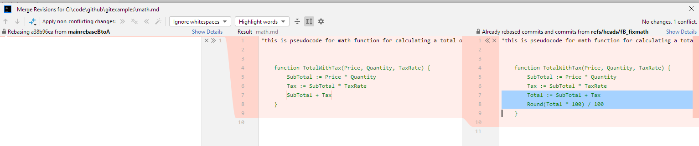
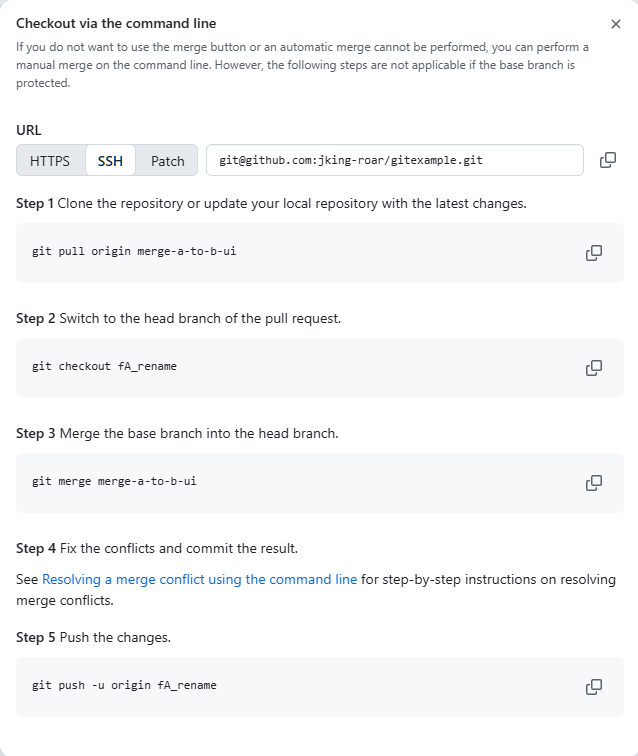

In this repo there are various branches to compare the strategies for getting features into main branches. 

- **main** (this branch)
- **mainoriginal** - with pseudocode in math.md
- **fA_rename** - renames the function defined and renames file from math.md to money_math.md
  - This is done in two commits, to simulate a dev removing the file already present and then adding a commit with the new file
- **fB_fixmath** - rounds the result of the function to 2 decimal places

To get the changes from both branches into **main**, you can choose to either rebase or merge.

- **mainmergeAtoB**, **mainmergeBtoA**, **rebaseAontoB** - these three branches demonstrating the aftermath of merging in either direction or rebasing feature A onto feature B have no complications and result in the same final pseudocode in the markdown file. Each three were done using IntelliJ's git tool, so may have differences with command line git with unmodified default settings.
- **rebaseBontoA** has complications, discussed below

Rebasing the math update onto the file rename results in a conflict that must be resolved by the user:

The **rebaseBontoA** branch is the result of manually copying the code update from the file about to be updated, applying the rebase, and then pasting the code back in after choosing to delete the original file.

The last two branches are the result of a developer choosing to either accept the file deltion or the math update and then letting the tool continue the rebase.
- **rebaseAontoBacceptA** - results in the file with correct math being deleted and the file with the original math being added.
- **rebaseAontoBacceptB** - results in the original file being updated with correct math but an additional file with the original math being present.

The other two branches, `merge-a-to-b-ui` and `merge-b-to-a-ui`, are for demonstrating how the pull requests created in GitHub would show conflicts to be resolved by the user:

The resolution strategy suggested by GitHub is to do a merge from the destination branch to the source branch
